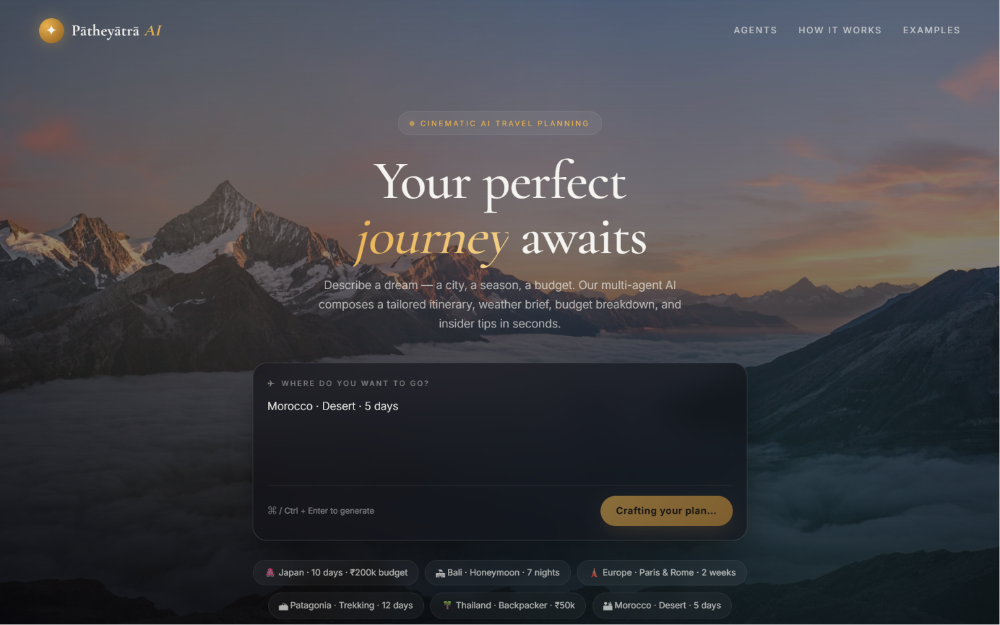
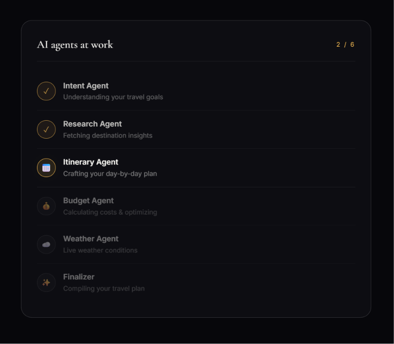
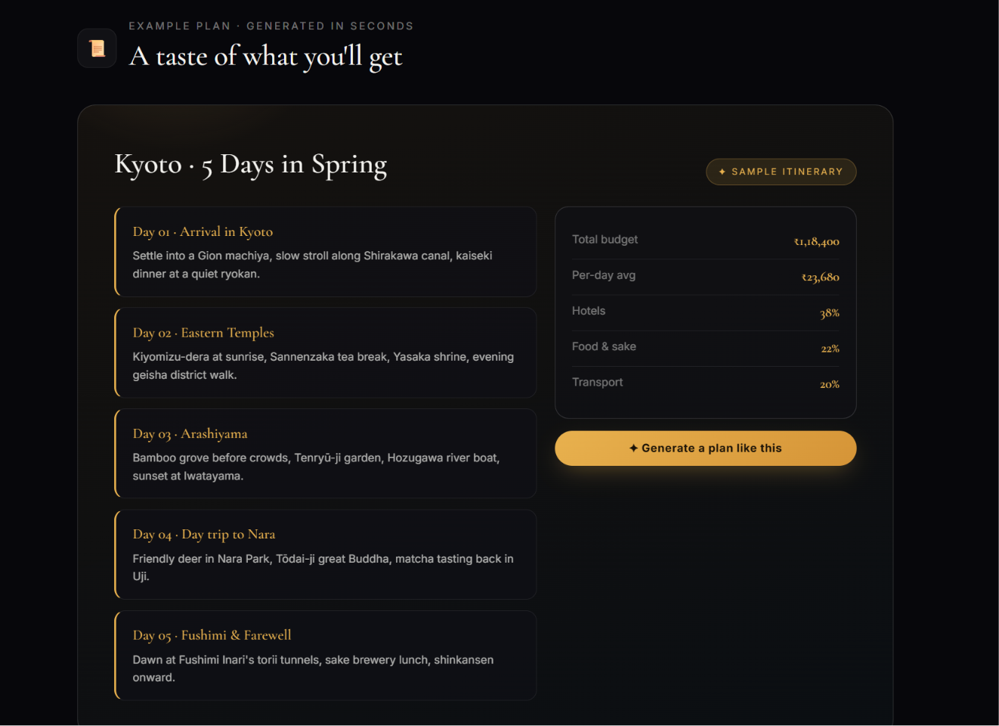
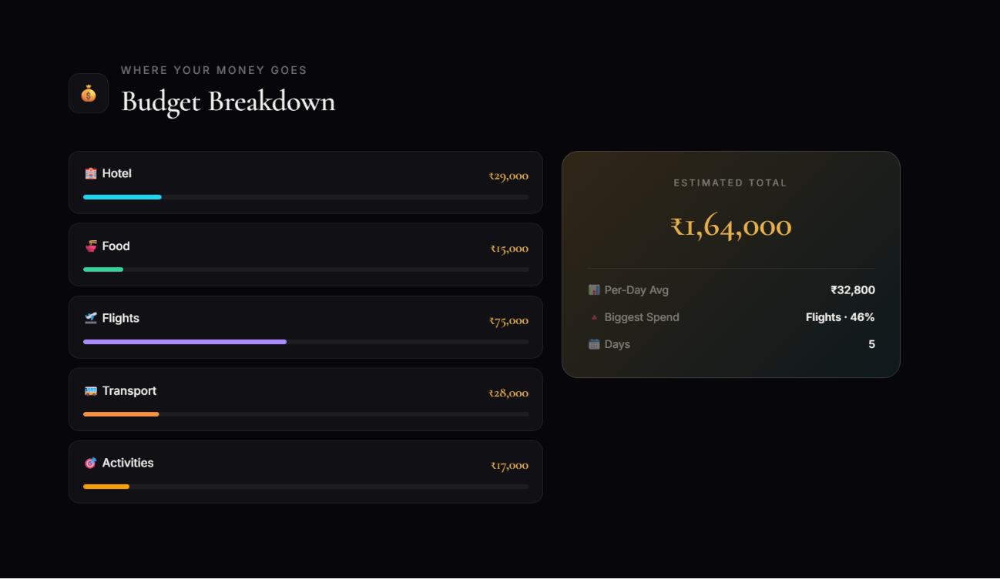
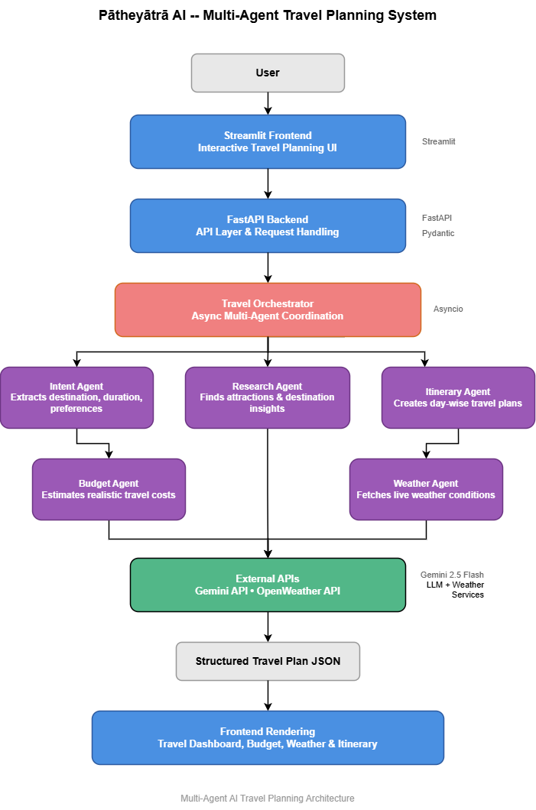

# Pātheyātrā AI — Multi-Agent Travel Planner

Pātheyātrā AI is an AI-powered multi-agent travel planning system that generates personalized travel itineraries, budget breakdowns, destination insights, and weather information using orchestrated AI agents.

The project demonstrates modular AI-agent architecture using FastAPI, Gemini API, and asynchronous orchestration.

---

# Features

- Multi-Agent AI Architecture
- Intent Extraction from Natural Language
- Destination Research & Recommendations
- Day-wise AI Itinerary Generation
- Smart Budget Estimation
- Live Weather Integration
- FastAPI Backend
- Gemini API Integration

- Modular & Scalable Code Structure
- Async Workflow Orchestration
- Structured JSON-based Agent Communication

---

# AI Agent Workflow

Pātheyātrā AI uses multiple specialized AI agents coordinated by a central orchestrator.

## Intent Agent

Extracts:

- destination
- duration
- budget
- travel preferences

from the user's natural language query.

---

## Research Agent

Collects:

- destination insights
- top attractions
- local transport methods
- best time to visit

---

## Itinerary Agent

Generates a personalized day-by-day itinerary based on:

- trip duration
- user preferences
- destination context

---

## Budget Agent

Calculates realistic travel expenses including:

- hotel
- food
- flights
- local transport
- activities

while keeping estimates close to the user's budget.

---

## Weather Agent

Fetches live weather data for the selected destination using weather APIs.

---

# System Architecture

```text
                ┌────────────────────┐
                │   React UI (Vite)  │
                └─────────┬──────────┘
                          │
                          ▼
                ┌────────────────────┐
                │    FastAPI API     │
                └─────────┬──────────┘
                          │
                          ▼
                ┌────────────────────┐
                │ Travel Orchestrator│
                └─────────┬──────────┘
                          │
      ┌───────────────────┼───────────────────┐
      ▼                   ▼                   ▼
┌────────────┐    ┌────────────┐    ┌────────────┐
│Intent Agent│    │Research Ag.│    │Itinerary Ag│
└────────────┘    └────────────┘    └────────────┘
      ▼                   ▼                   ▼
┌────────────┐    ┌────────────┐
│Budget Agent│    │Weather Ag. │
└────────────┘    └────────────┘
```

# Detailed Tech Stack

## Frontend

- React + Vite frontend
- Custom CSS
- Responsive UI Components

NOTE: This project uses the React + Vite frontend in `frontend/` as the primary UI.

## Backend

- FastAPI
- Uvicorn
- Asyncio

## AI & LLM

- Gemini 2.5 Flash API
- Prompt Engineering
- Multi-Agent Orchestration

## Data Validation

- Pydantic

## APIs

- Gemini API
- OpenWeatherMap API

## Utilities

- Requests
- JSON
- Regex
- Environment Variables (.env)

## Development Tools

- VS Code
- Python Virtual Environment (venv)
- Git & GitHub

## Getting Started (local)

1. Start the FastAPI backend (from project root):

```bash
uvicorn main:app --host 127.0.0.1 --port 8000
```

2. Run the React + Vite frontend (optional):

```bash
cd frontend
npm install
npm run dev
# Open http://localhost:8081/ (Vite may pick a different port if 8080/8081 are in use)
```

Note: The React frontend shows the agent workflow and generated plan together under the hero (center area) by design (Option A placement).

# Design Decisions

## Why Multi-Agent Architecture?

A modular multi-agent system improves:

- separation of concerns
- maintainability
- scalability
- independent reasoning workflows

Each agent specializes in a dedicated task rather than relying on one monolithic prompt.

---

## Why FastAPI?

FastAPI was chosen because it provides:

- fast async request handling
- clean API architecture
- lightweight backend performance
- easy frontend integration

---

## Why Gemini API?

Gemini was selected for:

- fast inference speed
- structured JSON generation
- cost efficiency
- strong reasoning capabilities

# Scalability Considerations

The architecture is designed to support future scaling:

- additional AI agents can be added independently
- external APIs can be integrated modularly
- orchestration logic is centralized
- frontend and backend are decoupled
- caching system reduces repeated API calls

Potential future upgrades include:

- WebSocket-based live agent synchronization
- persistent databases
- vector memory systems
- autonomous booking workflows

# Challenges Faced

During development, several engineering challenges were addressed:

- handling inconsistent LLM JSON outputs
- prompt optimization for structured responses
- frontend/backend synchronization
- realistic travel budget estimation
- API quota limitations
- workflow orchestration timing
- graceful fallback handling for malformed responses

# Learnings From The Project

This project provided hands-on experience with:

- AI agent orchestration
- prompt engineering
- async backend systems
- API integration
- frontend/backend communication
- structured LLM pipelines
- production-style debugging
- modular AI system design

# Screenshots

## Homepage



---

## AI Agent Workflow



---

## Japan Travel Plan Example



---

## Budget Breakdown



# System Architecture

